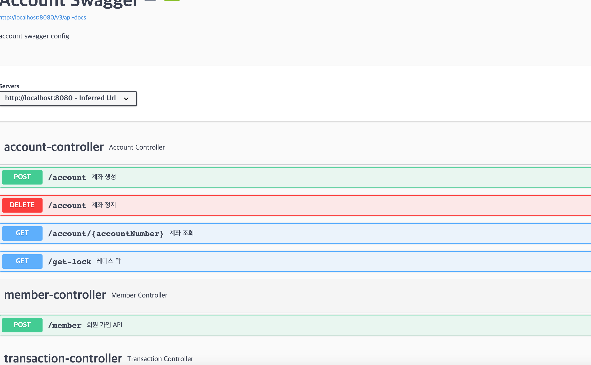
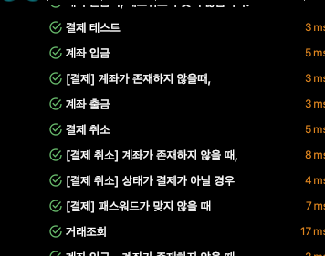

# 계좌 시스템 API 만들기

- 요구사항

1. 목적

> 우리 회사는 신규 사업으로 핀테크를 하려고 한다.  
> 핀테를 하려면 제일 먼저 필요한 사용자들 마다 계좌 시스템이 필요할 것같다.

2. 구체화

> Account(계좌) 시스템은 사용자와 계좌의 정보를 저장하고 있으며,  
> 외부 시스템에서 거래를 요청할 경우 거래 정보를 받아서 계좌를 받아서 잔액을 거래금액만큼 줄이거나(결제), 거래금액만큼 늘리는 (결제 취소) 거래 관리 기능을 제공하는 시스템입니다.

- 1. 사용자 정보
        
사용자는 신규 등록, 해지, 중지 사용자 정보 조회 등의 기능을 제공해야 하지만  
최초 버전에서는 빠른 서비스 오픈을 위해 사용자 등록, 해지, 중지 기능은 제공하지 않고 DB로 수기 입력을 합니다.

- 2. 계좌

계좌는 계좌 추가, 해지, 확인 기능을 제공합니다. 한 사용자는 최대 10개의 계좌를 가질 수 있고 그 이상의 계좌는 생성하지 못한다.  
계좌 번호는 10자리의 정수로 이루어지며 중복이 불가능하다.  
빠르고 안정적인 진행을 위해 계좌번호는 순차 증가하도록 한다.

거래는 작액 사용, 잔액 사용 취소, 거래 확인 기능을 제공합니다.


- 기술 스택

<div align="center">
    &nbsp 
    &nbsp
    &nbsp
</div>


- ERD


## 사용 방법

1. postman으로 API 테스트를 많이 하지만 저는 인텔리제이에서 지원하는 기능을 사용하였습니다.  

```/main/resource/request.http```


2. libary인 swagger을 사용하여 테스트도 가능합니다.




## API 목록

### 회원 가입

- 요청


- 응답


---

### 계좌 정지(해지)

- 요청


- 응답


---

### 계좌 조회 API

- 요청


- 응답


---

### 계좌 생성

- 요청


- 응답


---

### 입금 API

- 요청


- 응답 


---

### 출금 API

- 요청


- 응답


---

### 결제 API

- 요청


- 응답


---

### 결제 취소 API

- 요청


- 응답


---

### 거래내역 조회 API

- 요청


- 응답


### 해결 하는 노력

#### 락

1. 처음에는 JPA 에서는 Lock 을 거는 방식을 도입했었습니다.


2. 하지만, 레디스를 사용하기 떄문에 Lock 기능을 이용하였습니다.


### Cache 

1. @Cachable 을 사용하여 거래내역을 캐싱 처리 했습니다.


### 아쉬운점

## Jacoco 

1. 왼쪽 탭의 gradle에서 verification -> test를 실행한다.


2. 테스트 코드가 실행이 된다.




3. build 폴더에 tests -> test -> index.html를 열어본다.


4. 테스트 성공/ 실패율을 알수 있다.


5 [여기서 아쉬운 부분] 모든 곳을 채워 테스트 케이스 100%을 만들고 싶다.


### Redis port

1. 중복 방지를 위해 shell 을 사용한다.

- 단점 : window에서는 제대로 작동을 안함 ... 해결방안 찾는중...

